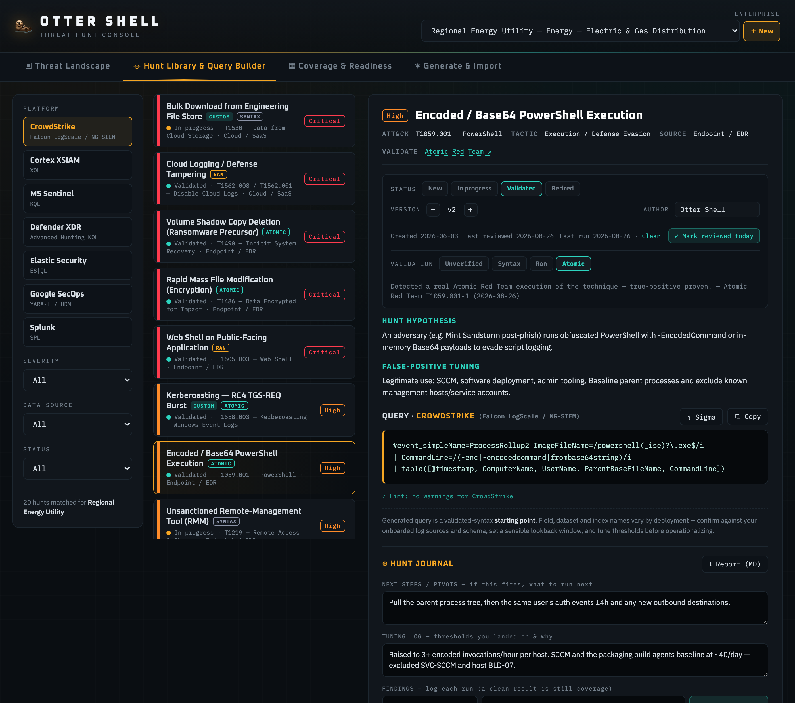
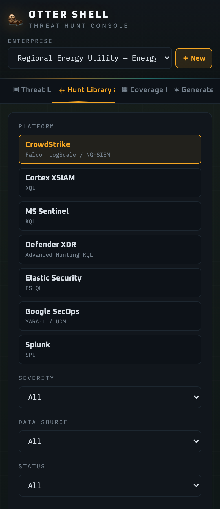

# Otter Shell — Threat Hunt Console

> [!IMPORTANT]
> **This is a test / portfolio project, not production security tooling.** It is published
> to demonstrate the design and engineering, and it is not supported, not maintained on any
> schedule, and carries no warranty (see [LICENSE](LICENSE)). Nothing here has been validated
> against a live SIEM by its author — every generated query is a **starting point** you must
> confirm and tune yourself. Do not wire it into a real detection pipeline and assume it works.

A defensive **threat-hunt authoring and tracking** console. It generates SIEM/EDR hunt
queries across 7 platforms from ATT&CK techniques, CISA KEV data, and threat reports,
tracks each hunt through a lifecycle with a findings journal, and exports to Sigma and
Detection-as-Code. It does **not** connect to your SIEM or run queries — every query is a
validated-syntax **starting point** to confirm and tune in your environment.

> This is the single-file React component wrapped in a Vite harness, with a Vitest suite
> covering its pure logic. It is **not** the full TypeScript/Zustand port — that is still
> specified under `migration/`. The component remains one file; the harness exists to run,
> test, harden and ship it.

## Screenshots

| Hunt Library & Query Builder | Coverage & Readiness |
|---|---|
|  |  |

| Threat Landscape | Generate & Import |
|---|---|
|  |  |

**Actively-exploited (CISA KEV) exposure, after a scan.** The one panel that reads live
data: it pulls the current CISA catalog and filters it against this enterprise's
internet-facing stack.


<p align="center">
  
</p>

> The Coverage and Hunt Library shots above have the demo programme loaded — click
> **Load a demo programme** on the Coverage tab to seed the same worked example
> (findings, tuning notes, validation states and two custom hunts). With no AI backend
> configured the Sigma converter is the first card on Generate & Import, and its sample
> rule is prefilled, so that shot is two clicks from a cold start. The KEV panel is one
> click — **Scan KEV catalog** — and what it shows is whatever CISA published that day,
> so your run will not match this capture CVE-for-CVE.

## Run it

Requires Node 18+.

```bash
npm install
npm run dev
```

Vite opens http://localhost:5173 automatically.

```bash
npm run build     # production build into dist/
npm run preview   # serve the built bundle — this is where the real CSP applies
npm run headers   # regenerate netlify.toml / vercel.json from csp.config.js
npm test          # Vitest suite (54 tests)
```

### Tests

`npm test` runs 54 tests across two files:

- `src/__tests__/sanitizers.test.js` — the untrusted-input sanitizers, including a
  regression test for a workspace file that used to blank the page.
- `src/__tests__/library.test.js` — library invariants (all 18 hunts carry a query for
  all 7 platforms), the Sigma round-trip, the linter's silence on the curated library,
  ATT&CK helpers, KEV matching and the markdown export.

The linter test is the load-bearing one: it asserts the query linter raises **zero**
warnings across all 126 curated queries, so a linter false positive or a malformed query
fails the build rather than quietly eroding trust in the amber warnings.

The linter has two levels and the UI keeps them apart. A **warning** (amber, `⚠ Warning —`)
says the query itself looks wrong — that is the count the zero-warnings claim is about. A
**note** (`ℹ Note —`) is context for running it, most often "no explicit time window in the
query", which is expected: most curated queries take their lookback from the console's own
time picker rather than hardcoding one. The lint header states the warning count first, so a
note can never be misread as a failing query.

### Security posture

The built bundle carries a strict Content-Security-Policy (`default-src 'none'`,
`script-src 'self'`, no inline script), injected at build time from `csp.config.js`. The same
file generates the HTTP headers in `netlify.toml` and `vercel.json`, so the meta tag and the
headers cannot drift apart. `connect-src` admits exactly one host — the CISA KEV feed — plus
your proxy's origin if, and only if, you configured one.

The CSP applies to built output only. The dev server injects an inline React Refresh preamble
that a strict `script-src` blocks, and weakening the policy to accommodate dev would mean never
exercising the policy you actually ship. Use `npm run preview` to test it.

`docs/security-audit.md` records both audit passes, including what was fixed, what was
reproduced first, and what residual risk is knowingly accepted.

## What works locally vs. what doesn't

**Works fully offline / locally:**
- The full hunt library (18 curated hunts, queries for all 7 platforms)
- Five enterprise threat profiles — a flagship Regional Energy Utility plus generic
  government, technology, healthcare and finance orgs. All are illustrative sector
  composites; no real organisation is named or profiled.
- Hunt lifecycle, findings journal, IOC enrichment links, validation-provenance field
- Sigma import/export (per-hunt + bulk), JSON import, Detection-as-Code export
- ATT&CK coverage map + Navigator layer export
- Telemetry-readiness audit
- **CISA KEV catalog scan** — fetches the public CISA feed directly (CORS-open), works locally
- Workspace save/load, markdown report export
- **Autosave to this browser** — work survives a reload; the file export is for moving
  between browsers or keeping a snapshot
- **Demo programme** — one click seeds a worked hunt programme so the Coverage view shows
  a real history instead of zeros
- Custom enterprise builder, query linter, deployment (connector) notes

**Off unless you configure a backend:**
- **The AI generator** (Generate Hunt / Report→hunt / Intel→hunt) and the **KEV
  model-fallback**. These call the Anthropic Messages API. In the hosted claude.ai artifact
  the runtime injected the API key transparently; nowhere else can, because a key shipped in
  a frontend bundle is a published key. So they are opt-in: set `VITE_CLAUDE_PROXY_URL` to a
  proxy that holds the key server-side and they switch on. Left unset, the Forge tab shows a
  notice explaining why and the button is disabled — no confusing auth/CORS failure. See
  [Enabling the AI generator](#enabling-the-ai-generator).

## Enabling the AI generator

The AI features read one environment variable, `VITE_CLAUDE_PROXY_URL`. There is no
hardcoded endpoint and no code to edit.

1. Read `migration/03_PROXY_CONTRACT.md` and run `migration/proxy_starter.py`
   (FastAPI; keeps your `ANTHROPIC_API_KEY` server-side only).
2. Copy `.env.example` to `.env.local` and point the variable at it:

   ```bash
   cp .env.example .env.local
   # then set: VITE_CLAUDE_PROXY_URL=http://localhost:8000/api/claude
   ```

3. Restart `npm run dev` (Vite reads env at startup). The Forge notice disappears and the
   generate button enables.

**Never put the API key in this frontend.** Vite inlines every `VITE_*` value into the public
bundle, so a key there is a published key — that is exactly what the proxy exists to prevent.
`VITE_CLAUDE_PROXY_URL` holds a *URL*, never a credential. See `docs/security-audit.md` §2.

A public proxy is a public spend endpoint: anyone who finds the URL can burn your API credits.
If you deploy one, put an origin allowlist and rate limiting in front of it — the contract doc
covers both.

## Deploying

The build is a static SPA with no server dependency, no router and no backend calls except the
CISA KEV feed. Vercel and Netlify both auto-detect Vite, so no config file is needed:

```bash
npm run build     # → dist/
```

- **Vercel** — import the repo; it detects Vite (build `npm run build`, output `dist`).
- **Netlify** — same; build `npm run build`, publish directory `dist`.
- Add `VITE_CLAUDE_PROXY_URL` in the host's environment-variable settings **only** if you have
  deployed a proxy. Without it the site ships with AI generation cleanly disabled, which is a
  perfectly good demo — the hunt library, Sigma round-trip, ATT&CK coverage map, telemetry
  audit and the live KEV scan all work.

Note for GitHub Pages: it serves from a subpath, so you would also need `base: "/<repo>/"` in
`vite.config.js`. Vercel and Netlify serve from root and need no such change.

## Project layout

```
src/OtterShell.jsx     The tool (single-file React component, ~3,100 lines)
src/main.jsx           Mounts the component
index.html             Vite entry
.env.example           Copy to .env.local to switch the AI generator on
csp.config.js          Single source of truth for the Content-Security-Policy
scripts/gen-headers.mjs  Regenerates netlify.toml + vercel.json (npm run headers)
netlify.toml           Netlify build + security headers
vercel.json            Vercel build + security headers
docs/
  hunt-validation.md   How to validate hunts against a real SIEM (Splunk/Sentinel/Elastic
                       + Atomic Red Team). The runbook that makes "it works" defensible.
  security-audit.md    Scoped security audit (query-gen safety, secrets, tenancy, deps, data)
  feature-audit.md     Feature/implementation audit
migration/             The full production-port package (read 00_START_HERE.md first):
  00_START_HERE.md       Entry point + non-negotiables
  01_MIGRATION_PLAN.md   7-phase plan with acceptance criteria + known followups
  02_ARCHITECTURE.md     Target Vite+React+TS+Vitest+Zustand architecture
  03_PROXY_CONTRACT.md   API proxy contract (key isolation, rate limits, CORS)
  04_TEST_PLAN.md        Vitest suite spec (Sigma round-trip, lint invariant, regressions)
  05_DESIGN_PRINCIPLES.md Honesty layer, defensive-only, no-live-data, visual identity
  proxy_starter.py       Working FastAPI reference proxy
```

## Design stance

- **Honesty layer.** Generated queries are labeled validated-syntax starting points, not
  turnkey detections. Keep the disclaimers — they're a feature.
- **Defensive-only.** The tool authors and tracks hunts; it never touches live telemetry.
- **No live data.** Nothing persists or transmits except user-initiated actions (Anthropic
  on Generate, enrichment links on click, KEV fetch, local downloads). See `docs/security-audit.md` §5.

## License

Apache License 2.0 — see [LICENSE](LICENSE).
